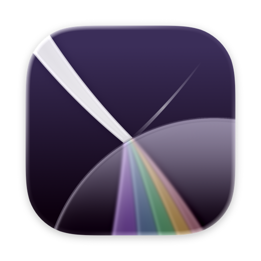

<div align="center">



# Refrax

**a maximalist browser for macOS ・ native, in Swift and WebKit ♡**

[](https://kagerou.glass/refrax/)
[](https://x.com/kageroumado)
[](LICENSE)
[](#building)


</div>

Refrax is a maximalist browser for macOS — built natively in Swift and WebKit, with the
features other browsers dropped and several that exist nowhere else. Vertical tabs, spaces you
can lock behind Touch ID, a command palette that takes plain language, a CLI that scripts the
whole browser, and an MCP server so an agent can browse beside you.

## Features

- **Vertical tabs & spaces.** Grouped tabs in a sidebar, organized into spaces — and any space can be locked behind Touch ID.
- **Plain-language command palette.** Type what you want in natural language, not just a fuzzy-matched command name.
- **Scriptable from the terminal.** `refrax-ctl` is a headless CLI that drives the entire browser: tabs, spaces, navigation, screenshots.
- **Agent-ready.** A built-in MCP server lets your AI agent browse alongside you.
- **Native Liquid Glass UI.** Swift and WebKit against the macOS 26 design system — not a re-skinned Chromium.

## Download

Builds and automatic updates are distributed from **<https://kagerou.glass/refrax/>**.

## Architecture

- **Tab** contains one or more **TabPages** (SwiftData, persisted)
- **WebPage**: runtime-only WKWebView wrapper, created on-demand by **WebPagePool**
- **WebView**: SwiftUI view displaying a WebPage (1:1)
- **Pattern**: environment injection with a Manager (Store) pattern — views consume managers via `@Environment`

## Project layout

```
Refrax/                     The app source
RefraxTests/                Swift Testing suites
RefraxWidgets/              Widget extension
refrax-ctl/                 Headless CLI for controlling the browser
Packages/refrax-protocol/   Swift package shared by app + CLI
Scripts/                    Build-time scripts (palette generator)
Refrax.xcodeproj/           Xcode project
```

## Requirements

- **macOS Tahoe 26+**
- **Xcode 26+** to build, with Swift 6.2 strict concurrency enabled

## Building

First-time setup installs Homebrew, SwiftFormat, SwiftLint, and a pre-commit hook:

```bash
./setup.sh
```

Then open `Refrax.xcodeproj` in Xcode and build the `Refrax` scheme.

> **Note:** Code signing is intentionally not configured in this repository. To build
> locally, set your own `DEVELOPMENT_TEAM` and bundle identifiers in Xcode's signing
> settings, and provide your own iCloud container if you want CloudKit sync to work.

## Code style

- Swift 6.2 with strict concurrency, `@MainActor` isolation by default
- SwiftFormat runs as a pre-commit hook
- The Xcode project uses **folder references** — add and remove files on disk, not through the Xcode UI
- Use `Color.appAccentColor`, not `Color.accentColor`
- Extensions of built-in types live in `Extensions/TypeName+Extensions.swift`; extensions of project types go in the source file directly

## License

Refrax is free software, licensed under the **GNU General Public License, version 3** — see
[LICENSE](LICENSE).

The **Refrax name and icon are trademarks** of kageroumado and are not covered by the GPL. If
you fork and redistribute, you must rebrand — see [TRADEMARK.md](TRADEMARK.md) for the policy.

In short: study, modify, and contribute freely. Just don't ship a modified version *as Refrax*.

## Contributing

Issues and PRs welcome. Read [CONTRIBUTING.md](CONTRIBUTING.md) before a big change.

Security issue? Don't open a public issue — see [SECURITY.md](SECURITY.md).

Also: [CODE_OF_CONDUCT.md](CODE_OF_CONDUCT.md).

## Contact

<requests@refrax.website>
