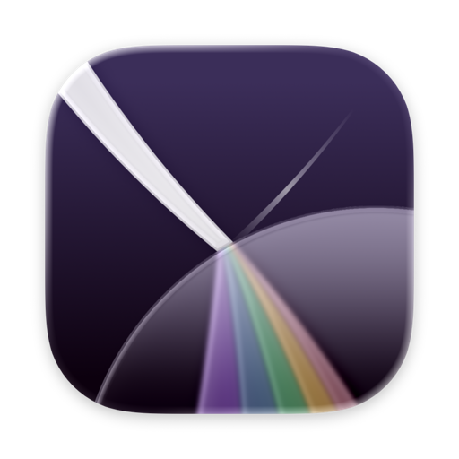

<div align="center">



# Refrax

**a maximalist browser for macOS ・ native, in Swift, on WebKit or Chromium ♡**

[](https://kagerou.glass/refrax/)
[](https://x.com/kageroumado)
[](LICENSE)
[](#building)


</div>

Refrax is a maximalist browser for macOS — built natively in Swift, with the features other
browsers dropped and several that exist nowhere else. Vertical tabs, spaces you can lock behind
Touch ID, a command palette that takes plain language, a CLI that scripts the whole browser for
you or your agent, and a choice of rendering engine: WebKit, or Chromium for the sites that need
it, page by page.

## Features

- **Vertical tabs & spaces.** Grouped tabs in a sidebar, organized into spaces — and any space can be locked behind Touch ID.
- **Plain-language command palette.** Type what you want in natural language, not just a fuzzy-matched command name.
- **Scriptable from the terminal.** `refrax-ctl` is a headless CLI that drives the entire browser: tabs, spaces, navigation, screenshots.
- **Agent-ready.** Claude Code, Codex, or any agent that runs shell commands drives Refrax through `refrax-ctl`; Refrax installs its skill for Claude Code.
- **WebKit or Chromium, per page.** Pages render with WebKit by default, or with Chromium: switch the default engine, or reload any tab in another engine. See [Engines](#engines).
- **Native Liquid Glass UI.** Built in Swift with the macOS design system.

## Download

Builds and automatic updates are distributed from **<https://kagerou.glass/refrax/>**.

## Engines

Refrax renders with **WebKit** out of the box and can add **Chromium**:

1. **Install it** in **Settings → Engines**. Refrax downloads a signed, notarized build and keeps it updated alongside the app.
2. **Pick the default engine** in the same pane: new pages render with it.
3. **Reload any tab in another engine** from the reload button's menu, or **View → Reload in Chromium** (or WebKit). A tab remembers its engine.

Your tabs, spaces, history, content blocking, per-site settings, routing rules and
pinned-tab previews work with either engine, and `refrax-ctl` drives both the same way.

Refrax talks to an engine only through a documented contract,
[`Engines/CONTRACT.md`](Engines/CONTRACT.md): events out, commands in, and requests Refrax
answers, over the binary interface in [`Engines/SDK/RFXEngine.h`](Engines/SDK/RFXEngine.h).
Chromium is one implementation (its host lives in [`Engines/Chromium`](Engines/Chromium)); any
engine that implements the contract can plug in, and
[`Engines/Conformance`](Engines/Conformance) checks an engine bundle against it. Refrax currently
loads only engines signed by the Refrax team: the contract describes trusting another
developer's signature, and Refrax doesn't implement that step yet.

## Architecture

- **Tab** contains one or more **TabPages** (SwiftData, persisted)
- **WebPage**: runtime-only page, created on demand by **WebPagePool**, rendered by WebKit or by a plug-in engine behind the engine contract
- **WebView**: SwiftUI view displaying a WebPage (1:1)
- **Pattern**: environment injection with a Manager (Store) pattern — views consume managers via `@Environment`

## Project layout

```
Refrax/                     The app source
RefraxTests/                Swift Testing suites
RefraxWidgets/              Widget extension
refrax-ctl/                 Headless CLI for controlling the browser
Packages/refrax-protocol/   Swift package shared by app + CLI
Scripts/                    Build-time scripts (palette generator)
Engines/                    Engine contract, SDK, Chromium engine, conformance suite
Refrax.xcodeproj/           Xcode project
```

## Requirements

- **macOS 26+**
- **Xcode 26+** to build, with Swift 6.2 strict concurrency enabled

## Building

First-time setup installs Homebrew, SwiftFormat, SwiftLint, and a pre-commit hook:

```bash
./setup.sh
```

Then open `Refrax.xcodeproj` in Xcode and build the `Refrax` scheme.

> **Note:** Code signing is intentionally not configured in this repository. To build
> locally, set your own `DEVELOPMENT_TEAM` and bundle identifiers in Xcode's signing
> settings, and provide your own iCloud container if you want CloudKit sync to work.

## Code style

- Swift 6.2 with strict concurrency, `@MainActor` isolation by default
- SwiftFormat runs as a pre-commit hook
- The Xcode project uses **folder references** — add and remove files on disk, not through the Xcode UI
- Use `Color.appAccentColor`, not `Color.accentColor`
- Extensions of built-in types live in `Extensions/TypeName+Extensions.swift`; extensions of project types go in the source file directly

## License

Refrax is free software, licensed under the **GNU General Public License, version 3** — see
[LICENSE](LICENSE).

The **Refrax name and icon are trademarks** of kageroumado and are not covered by the GPL. If
you fork and redistribute, you must rebrand — see [TRADEMARK.md](TRADEMARK.md) for the policy.

Study, modify, and contribute freely. Just don't ship a modified version *as Refrax*.

## Contributing

Issues and PRs welcome. Read [CONTRIBUTING.md](CONTRIBUTING.md) before a big change.

Security issue? Don't open a public issue — see [SECURITY.md](SECURITY.md).

Also: [CODE_OF_CONDUCT.md](CODE_OF_CONDUCT.md).

## Contact

<mail@kagerou.glass>
